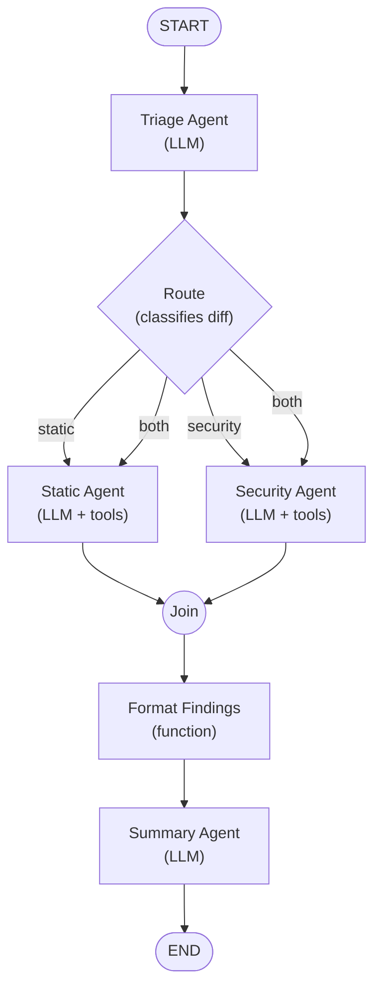

# graph-review

`graph-review` is a tool for performing automated code reviews using
AI agents. It is built with [Go](https://go.dev) and the
[ADK](https://github.com/agent-development-kit/agent-development-kit-go)
library, which provides the agent loop and graph primitives used to
orchestrate the review workflow.

## Overview

The project defines a set of cooperating agents, each responsible for a
distinct stage of the code review process:

- **Triage Agent** — classifies the diff and routes it to the appropriate
  reviewers.
- **Static Analysis Agent** — checks style, formatting, and common
  anti-patterns.
- **Security Agent** — looks for vulnerabilities and unsafe patterns.
- **Summary Agent** — aggregates findings into a single, human-readable
  review report.

These agents are wired together as a graph using the ADK library, which
manages the control flow, tool dispatch, and state transitions between
nodes.



The triage agent classifies the diff and emits one of `static`,
`security`, or `both`. A `MultiRoute` edge lets the `both` category fan
out to both reviewers with a single edge per target. A join node waits
for all active reviewers to complete, then the findings are formatted and
passed to the summary agent for a final report.

The reviewer agents (static and security) can call repo-inspection tools
to look beyond the diff hunks:

- `read_file` — read a repo-relative file
- `list_files` — list a directory's contents
- `git_blame` — blame a file line range
- `git_log` — recent commit history for a file or the repo

When reviewing a GitHub pull request, three additional tools are
available:

- `pr_files` — the PR's changed-file list with per-file patches
- `pr_comments` — line-anchored review comments left so far
- `pr_reviews` — prior reviews submitted on the PR

## Usage

### Review a diff

```sh
git diff | graph-review review diff -m <model>
graph-review review diff changes.patch --base-url http://localhost:11434/v1 -m llama3.1:latest
graph-review review diff changes.patch --provider anthropic -m claude-sonnet-4-20250514
```

The diff is read from a file argument or stdin. The reviewer tools are
rooted at `--repo` (default: working directory).

### Review a GitHub pull request

```sh
export GITHUB_TOKEN=<token>
graph-review review pr <owner/repo> <number> -m <model>
```

Example:

```sh
graph-review review pr geoffjay/graph-review 42 -m gpt-4o-mini
```

The PR subcommand fetches the diff from the GitHub REST API and
shallow-clones the head repo into a temp directory so the
repo-inspection tools have code to look at. Flags:

- `--github-token` — GitHub API token (defaults to `GITHUB_TOKEN`)
- `--no-clone` — skip the clone; tools fall back to the working directory
- `--clone-repo <path>` — use an existing local checkout instead of cloning
- `--no-tools` — disable all tools on the reviewer agents

Without a token, only public repos work and the API is rate-limited to 60
requests/hour.

### Model configuration

All subcommands share the model flags:

- `--provider` — model provider: `openai` or `anthropic` (auto-detected from env)
- `-m / --model` — model name (env `OPENAI_MODEL` or `ANTHROPIC_MODEL`)
- `--api-key` — API key (env `OPENAI_API_KEY` or `ANTHROPIC_API_KEY`)
- `--base-url` — endpoint URL (env `OPENAI_BASE_URL` or `ANTHROPIC_BASE_URL`)

#### OpenAI-compatible providers

The default `openai` provider works with OpenAI directly, with local
runtimes like [Ollama](https://ollama.com)
(`--base-url http://localhost:11434/v1`), or any other OpenAI-compatible
endpoint.

```sh
git diff | graph-review review diff -m gpt-4o-mini
graph-review review diff changes.patch --base-url http://localhost:11434/v1 -m llama3.1:latest
```

#### Anthropic (Claude)

The `anthropic` provider talks directly to Anthropic's native Messages
API, supporting Claude models without a translating proxy:

```sh
export ANTHROPIC_API_KEY=<key>
graph-review review diff -m claude-sonnet-4-20250514 --provider anthropic
```

The provider is auto-detected: if `ANTHROPIC_API_KEY` is set and
`OPENAI_API_KEY` is not, `anthropic` is used by default. Set
`--provider` explicitly to override.

## Status

This project is a work in progress. Agent definitions, graph wiring,
and tooling are under active development.