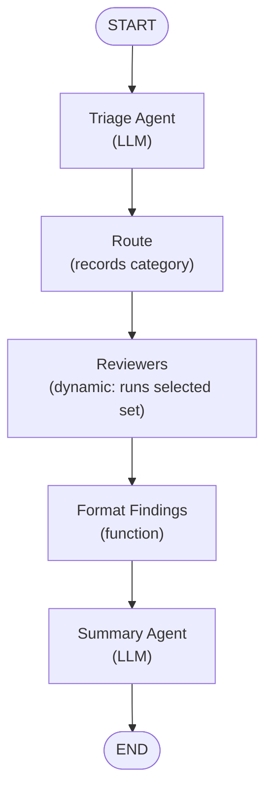

# agent-toolbox

`agent-toolbox` is a tool for performing automated code reviews using
AI agents. It is built with [Go](https://go.dev) and the
[ADK](https://github.com/agent-development-kit/agent-development-kit-go)
library, which provides the agent loop and graph primitives used to
orchestrate the review workflow.

## Overview

The project defines a set of cooperating agents, each responsible for a
distinct stage of the code review process:

- **Triage Agent** — classifies the diff and routes it to the appropriate
  reviewers.
- **Static Analysis Agent** — checks style, formatting, and common
  anti-patterns.
- **Security Agent** — looks for vulnerabilities and unsafe patterns.
- **Summary Agent** — aggregates findings into a single, human-readable
  review report.

These agents are wired together as a graph using the ADK library, which
manages the control flow, tool dispatch, and state transitions between
nodes.



The triage agent classifies the diff as `static`, `security`, or `both`.
The route node records the category in session state and passes the
review request through; the reviewers node is a dynamic orchestrator that
reads the category and runs exactly the reviewer agents triage selected,
in parallel, gathering their output into a map keyed by agent name. The
findings are then formatted and passed to the summary agent for a final
report.

The diff is presented to the reviewer agents with each added and context
line prefixed by its new-file line number, and the `read_file` tool uses
the same numbering — reviewers are instructed to cite those numbers
verbatim so the `file:line` references in the report (which anchor the
inline comments posted with `--post-comments`) match GitHub's line
coordinates.

## Repository rules

Repository-specific review rules can be placed in `.review/rules/` as
Markdown files with YAML frontmatter. Rules are loaded automatically from
the repo root (or from the clone when reviewing a PR) and appended to
matching agents' instructions.

### Rule file format

```markdown
---
title: "Require error wrapping"
agents: ["static_analysis", "security"]
severity: major
priority: 10
tags: ["go", "errors"]
---

All error returns must be wrapped with fmt.Errorf using %w to preserve
the error chain.
```

### Frontmatter fields

- `title` — human-readable rule name (default: filename)
- `agents` — list of agent names to scope the rule to: `triage`,
  `static_analysis`, `security`, `summary`, or `*` for all (required)
- `severity` — `blocker`, `major`, `minor`, or `nit` (default: `minor`)
- `priority` — numeric priority; higher = more important (default: `0`)
- `enabled` — set to `false` to disable a rule without deleting it
  (default: `true`)
- `tags` — free-form tags for grouping

Rules are sorted by priority (descending) then severity (blocker > major
> minor > nit) and appended to the agent's system instruction as
additional guidance. Use `--rules-dir` to override the default
`.review/rules` location.

The reviewer agents (static and security) can call repo-inspection tools
to look beyond the diff hunks:

- `read_file` — read a repo-relative file
- `list_files` — list a directory's contents
- `git_blame` — blame a file line range
- `git_log` — recent commit history for a file or the repo

When reviewing a GitHub pull request, three additional tools are
available:

- `pr_files` — the PR's changed-file list with per-file patches
- `pr_comments` — line-anchored review comments left so far
- `pr_reviews` — prior reviews submitted on the PR

## Usage

### Review a diff

```sh
git diff | agent-toolbox review diff -m <model>
agent-toolbox review diff changes.patch --base-url http://localhost:11434/v1 -m llama3.1:latest
agent-toolbox review diff changes.patch --provider anthropic -m claude-sonnet-4-20250514
```

The diff is read from a file argument or stdin. The reviewer tools are
rooted at `--repo` (default: working directory).

### Review a GitHub pull request

```sh
export GITHUB_TOKEN=<token>
agent-toolbox review pr <owner/repo> <number> -m <model>
```

Example:

```sh
agent-toolbox review pr geoffjay/agent-toolbox 42 -m gpt-4o-mini
```

The PR subcommand fetches the diff from the GitHub REST API and
shallow-clones the head repo into a temp directory so the
repo-inspection tools have code to look at. Flags:

- `--github-token` — GitHub API token (defaults to `GITHUB_TOKEN`)
- `--no-clone` — skip the clone; tools fall back to the working directory
- `--clone-repo <path>` — use an existing local checkout instead of cloning
- `--findings-gate` — pause after the reviewers finish and require a human
  decision on the findings before the summary runs. `approve` continues,
  `revise` loops the reviewers back with your feedback (up to 3 rounds),
  `abort` fails the run. Requires an interactive terminal; non-interactive
  input fails closed.
- `--post-comments` — post the review summary as a GitHub PR review with
  inline comments anchored to the file/line references in the findings
  (requires `--github-token`). Before anything is submitted, the full
  review body and inline comments are printed and human approval is
  required on the terminal; declined or non-interactive input aborts
  without posting.
- `--assume-yes` — skip the confirmation prompt and post unattended
  (for CI or scripted runs)

### Diagnostic logging

All review subcommands share the logging flags. Log output goes to
stderr; stdout stays reserved for the review report.

- `-v` — verbose: the resolved model/provider configuration, the tool
  list, the loaded rules directory, per-agent output size and tool-call
  counts, and retry activity.
- `-vv` (or `--debug`) — debug: every model event plus each tool call's
  arguments and result (payloads truncated at 4 KiB).
- `--debug` — same as `-vv`.

When a review finishes with no findings on a non-trivial diff, the
warning is followed by diagnostics showing what the pipeline actually
observed — per-agent output bytes, tool-call counts, and a hint when
`--no-clone` left the repo tools pointed at the wrong directory — to
distinguish an underpowered model from a broken pipeline.

Without a token, only public repos work and the API is rate-limited to 60
requests/hour.

To post the review back to GitHub:

```sh
agent-toolbox review pr geoffjay/agent-toolbox 42 -m gpt-4o-mini --post-comments
```

### Model configuration

All subcommands share the model flags:

- `--provider` — model provider: `openai` or `anthropic` (auto-detected from env)
- `-m / --model` — model name (env `OPENAI_MODEL` or `ANTHROPIC_MODEL`)
- `--api-key` — API key sent as `x-api-key` (env `OPENAI_API_KEY` or `ANTHROPIC_API_KEY`)
- `--auth-token` — `Authorization: Bearer` token for the Anthropic provider,
  used by gateways/proxies in front of Anthropic (env `ANTHROPIC_AUTH_TOKEN`)
- `--base-url` — endpoint URL (env `OPENAI_BASE_URL` or `ANTHROPIC_BASE_URL`)

#### OpenAI-compatible providers

The default `openai` provider works with OpenAI directly, with local
runtimes like [Ollama](https://ollama.com)
(`--base-url http://localhost:11434/v1`), or any other OpenAI-compatible
endpoint.

```sh
git diff | agent-toolbox review diff -m gpt-4o-mini
agent-toolbox review diff changes.patch --base-url http://localhost:11434/v1 -m llama3.1:latest
```

#### Anthropic (Claude)

The `anthropic` provider talks directly to Anthropic's native Messages
API, supporting Claude models without a translating proxy:

```sh
export ANTHROPIC_API_KEY=<key>
agent-toolbox review diff -m claude-sonnet-4-20250514 --provider anthropic
```

The provider is auto-detected: if `ANTHROPIC_API_KEY` is set and
`OPENAI_API_KEY` is not, `anthropic` is used by default. Set
`--provider` explicitly to override.

When talking to a gateway or proxy in front of Anthropic (any custom
`--base-url`/`ANTHROPIC_BASE_URL`), the credential is sent as an
`Authorization: Bearer` token, since gateways authenticate that way
rather than with the native `x-api-key` header. Setting `--api-key`
(or `ANTHROPIC_API_KEY`) alongside a custom base URL is enough — the key
is reused as the bearer token; use `--auth-token` when the bearer
credential differs from the API key. Direct Anthropic keeps `x-api-key`.

## Status

This project is a work in progress. Agent definitions, graph wiring,
and tooling are under active development.
